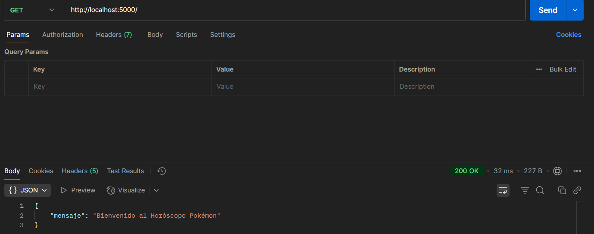
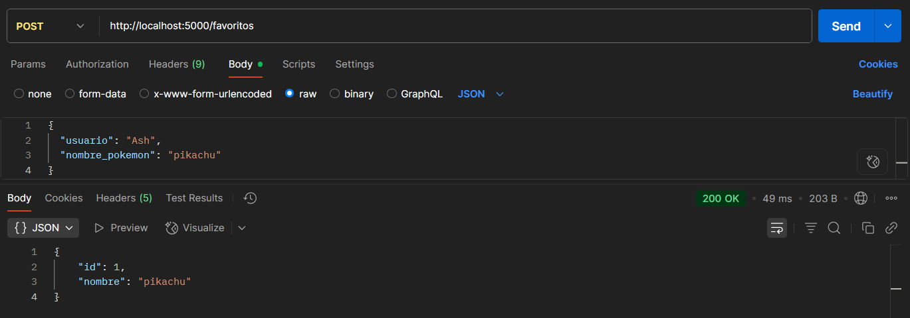

# Mini-proyecto-Flask
Proyecto de capacitación sobre flask

Introducción:
Este proyecto es una API REST en Python usando Flask, la idea es combinar información sobre los pokemon con un sistema de horóscopo y una lista de favoritos.
Para esto nos conectamos a la PokeAPI para obtener datos reales de todos los pokemones.

Funcionalidades principales:

   Horóscopo Pokémon:
      Recibe el nombre y la fecha de nacimiento de un usuario.
      Calcula el signo zodiacal y lo asocia con un Pokémon predefinido.
      Devuelve información de ese Pokémon.

   Buscador de Pokémon:
      Permite buscar Pokémon por nombre o por tipo.
      Devuelve una "ficha" con los datos más relevantes de cada Pokémon.

   Lista de Favoritos:
      Cada usuario puede guardar sus Pokémon favoritos.
      Se pueden listar, buscar y eliminar favoritos usando el archivo favoritos.json como almacenamiento local.

## Requisitos
- Docker
- Docker Compose

## Cómo correr el proyecto
1. Clona este repositorio.
2. Ejecuta:
   ```bash
   docker-compose build --no-cache
   docker-compose up
   o
   python main.py


## Pruebas con Postman

1. **GET /** – Muestra mensaje de bienvenida.

2. **POST /horoscopo** – Devuelve el Pokémon del signo zodiacal.

3. **GET /pokemon?nombre=...** – Busca Pokémon por nombre.

4. **GET /pokemon?tipo=...** – Busca Pokémon por tipo.

5. **POST /favoritos** – Guarda un Pokémon como favorito.

6. **GET /favoritos?usuario=...** – Lista los favoritos del usuario.

7. **GET /favoritos/{id}?usuario=...** – Obtiene un favorito específico.

8. **DELETE /favoritos** – Elimina un favorito.
